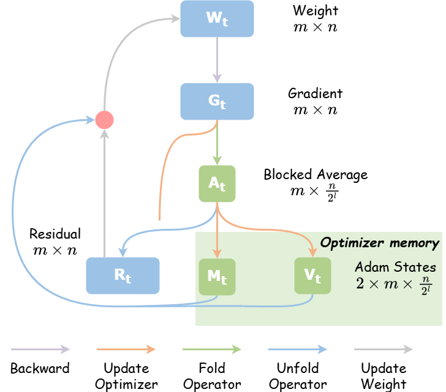
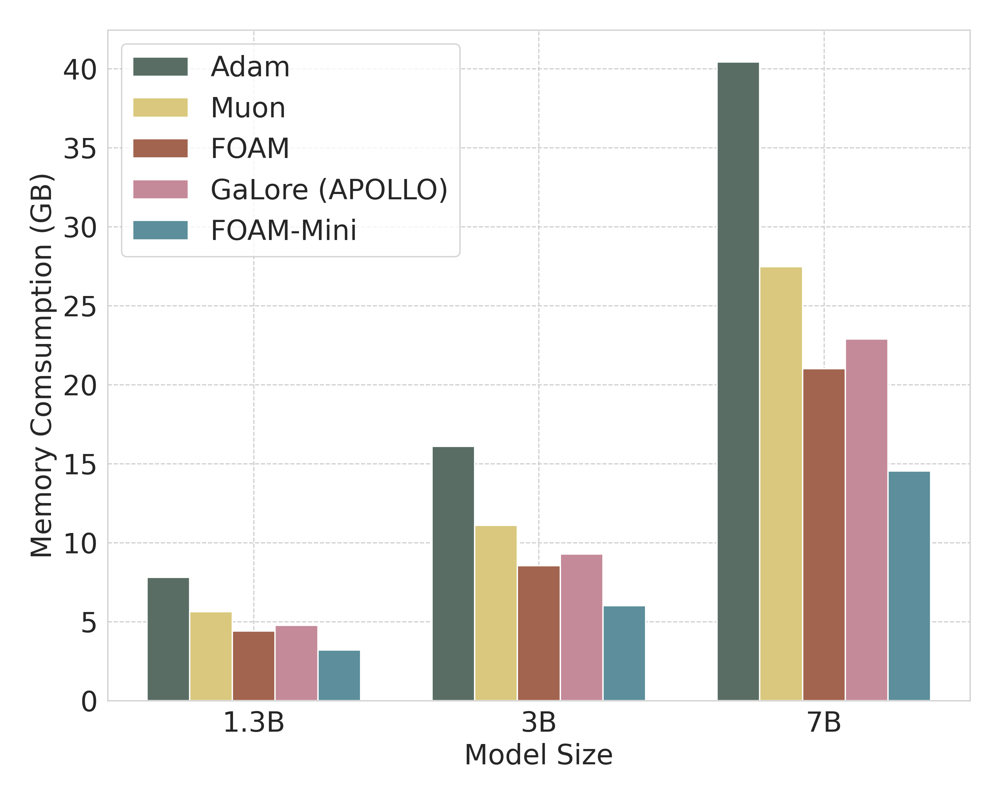
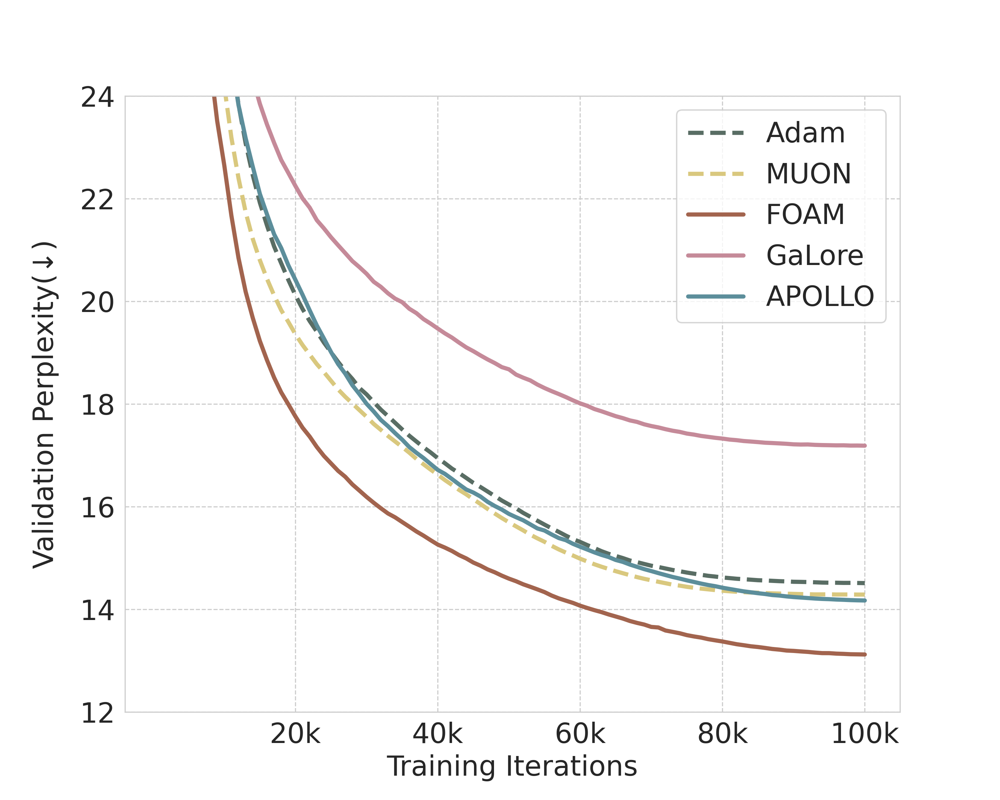

# FOAM: Blocked State Folding for Memory-Efficient LLM Training

This repo contains the official implementation for the paper *[FOAM: Blocked State Folding for Memory-Efficient LLM Training](https://arxiv.org/abs/2512.07112)*.

<table>
  <tr>
    <td align="center"><b>FOAM preview</b></td>
    <td align="center"><b>End to end memory estimate, BF16</b></td>
    <td align="center"><b>PPL learning curves for pre-training LLaMA-1.3B on C4</b></td>
  </tr>
  <tr>
    <td width="33%"></td>
    <td width="33%"></td>
    <td width="33%"></td>
  </tr>
</table>


## Reproducibility

All pre-training experiments were conducted using 1 to 32 NVIDIA RTX 3090 GPUs and 4 NVIDIA H100 GPUs with PyTorch version 2.3.0+cu118.  run

```bash
conda create $yourname python=3.11.9
conda activate $yourname
pip install -r requirements
```

We present the running scripts for pre-training LLaMA models in [here](sripts/). For fine-tuning RoBERTa models on GLUE, run

```bash
#!/bin/bash

export model_name_or_path=roberta-large
export warm_up=0.1
export task_name=cola
export epoch=3
export max_length=256
export level=8
export scale=2.5e-1
export scheduler=cosine

export scale=0.25
for lr in 2.0e-4
do
    for task_name in cola
    do
        python run_glue.py \
            --model_name_or_path $model_name_or_path \
            --task_name $task_name \
            --scale $scale \
            --enable_fold \
            --level $level \
            --lora_all_modules \
            --max_length $max_length \
            --seed 42 \
            --lr_scheduler_type $scheduler \
            --num_warmup_steps $warm_up \
            --per_device_train_batch_size 32 \
            --learning_rate $lr \
            --num_train_epochs $epoch \
            --output_dir $your_dir
        wait
    done
done
```

For the MMLU fine-tuning tasks, we adopt the implementation of LLaMA-Factory, see *[here](https://github.com/hiyouga/LlamaFactory)*

Citation

```latex
@article{wen2025foam,
  title={FOAM: Blocked State Folding for Memory-Efficient LLM Training},
  author={Wen, Ziqing and Wang, Jiahuan and Luo, Ping and Li, Dongsheng and Sun, Tao},
  journal={arXiv preprint arXiv:2512.07112},
  year={2025}
}
```
